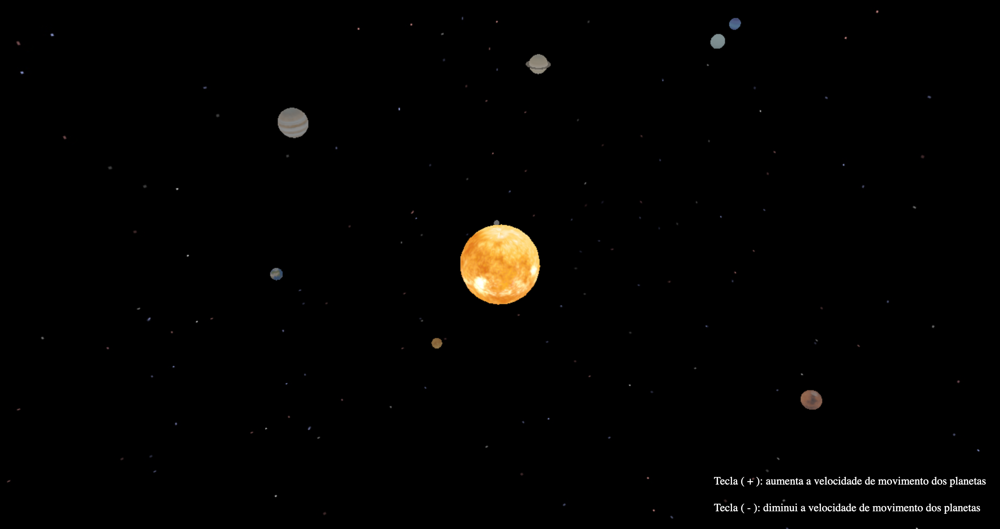
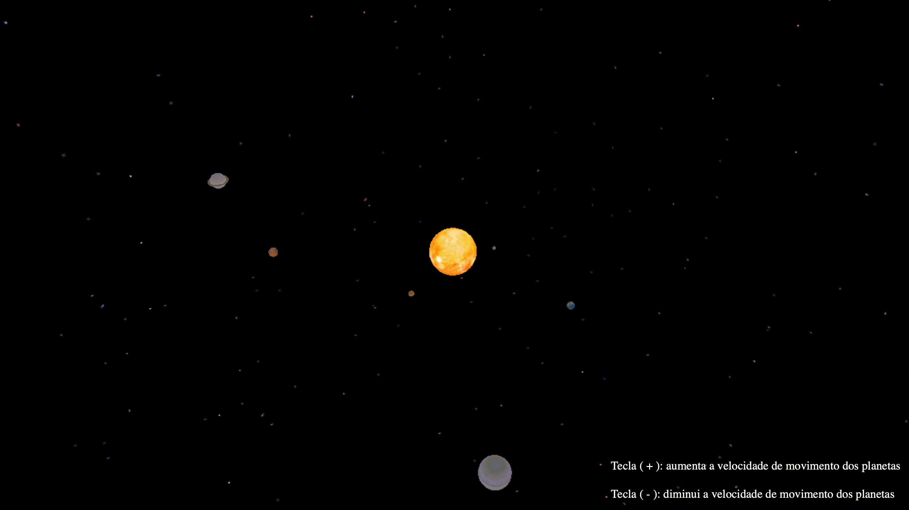

# Solar System


Cena em 3D com a formação e movimentação do Sistema Solar. O projeto foi criado durante a disciplina de Computação Gráfica do curso de Engenharia de Computação da Universidade Federal do Ceará. Sua execução pode ser vista em: <a href target="_blank">https://youtu.be/wmKmgr7_J5k</a>

## Setup

Na pasta [`Sistema_Solar`](Sistema_Solar) execute:
```bash
npm install
```

### Run
Na pasta [`Sistema_Solar`](Sistema_Solar) execute:
```bash
npm run dev
```

## Requisitos
O Projeto se trata de uma simulação/represetação do **Sistema Solar** utilizando como base a biblioteca [Three.JS](https://threejs.org/).

_A proposta completa do projeto e seus requisitos está disponível em [Descrição do projeto.pdf](./Descric%CC%A7a%CC%83o%20do%20projeto.pdf)._

### Prazo
- [X] O projeto deve ser finalizado e entregue até o dia _15 de Outubro de 2023_.

### Requisitos Básicos
O projeto precisa contear obrigatoriamente:

 - [X] `Requisito 1`: Uso de transformações geométricas e texturas para cada corpo celeste;
 - [X] `Requisito 2`: Apresentar os objetos referentes aos planetas e sol  
       _(Saturno pode apresentar seus anéis com mesmo recurso de textura mostrado em sala, mas os satélites de cada um dos planetas serão desconsiderados para este trabalho)_;
 - [X] `Requisito 3`: Aplicar o máximo de objetos referentes ao Sistema Solar na cena;
 - [X] `Requisito 4`: Aplicar a translação dos planetas ao redor do Sol;
 - [X] `Requisito 5`: Permitir a possibilidade de mudança de velocidade dos movimentos dos planetas por teclas;
 - [X] `Requisito 6`: Planetas realizarem a própria rotação em torno de cada si mesmos;
 - [X] `Requisito 7`: Incluir projeto no GitHub e no README adicionar link de vídeo de demonstração no Youtube mostrando o funcionamento da cena 3D;

### Extras
O projeto pode conter opcionalmente:

 - [X] `Extra 1`: Representação eficiente dos anéis de Saturno;
 - [ ] `Extra 2`: Representação de alguma(s) amostra(s) de satélite(s);
 - [X] `Extra 3`: Planetas ficarem em velocidades distintas;
 - [X] `Extra 4`: Adiciona teclas para interação do usuário.

## Demo



### Em movimento


### Vídeo do projeto
[](http://www.youtube.com/watch?v=wmKmgr7_J5k)

## Autores

<table>
  <tr>
    <td align="center">
      <a href="https://github.com/yarabrg" target="_blank">
        
        <br>
        <sub>Yara Silva</sub>
      </a>
    </td>
    <td align="center">
      <a href="https://github.com/rob-ec" target="_blank">
        
        <br>
        <sub>Robson Gomes</sub>
      </a>
    </td>
    <td align="center">
      <a href="https://github.com/luanmooraes" target="_blank">
        
        <br>
        <sub>Luan Moraes</sub>
      </a>
    </td>
    <td align="center">
      <a href="https://github.com/Jonatasmvb" target="_blank">
        
        <br>
        <sub>Jônatas Mendonça</sub>
      </a>
    </td>
    <td align="center">
      <a href="https://github.com/jonas-ar" target="_blank">
        
        <br>
        <sub>Jonas Fontenele</sub>
      </a>
    </td>
    <td align="center">
      <a href="https://github.com/vinic-costa" target="_blank">
        
        <br>
        <sub>Vinícius Santos</sub>
      </a>
    </td>
  </tr>
</table>
